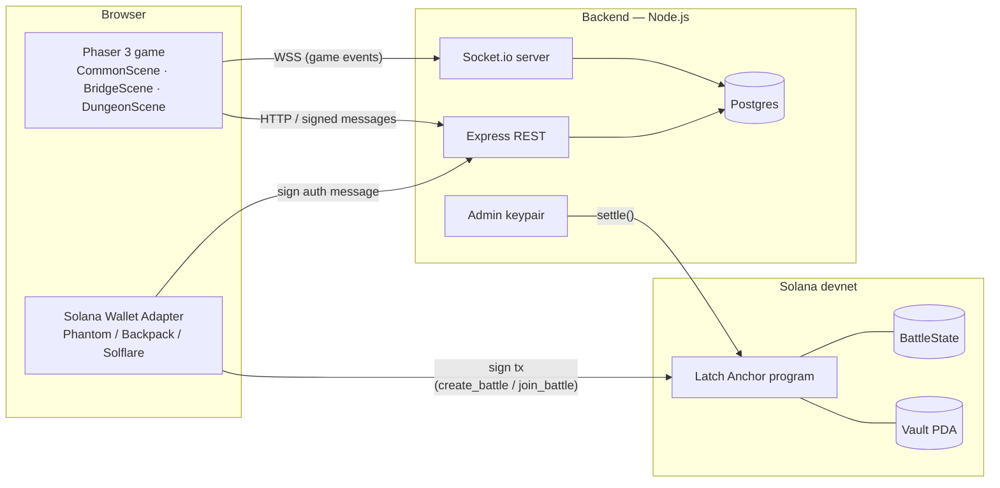
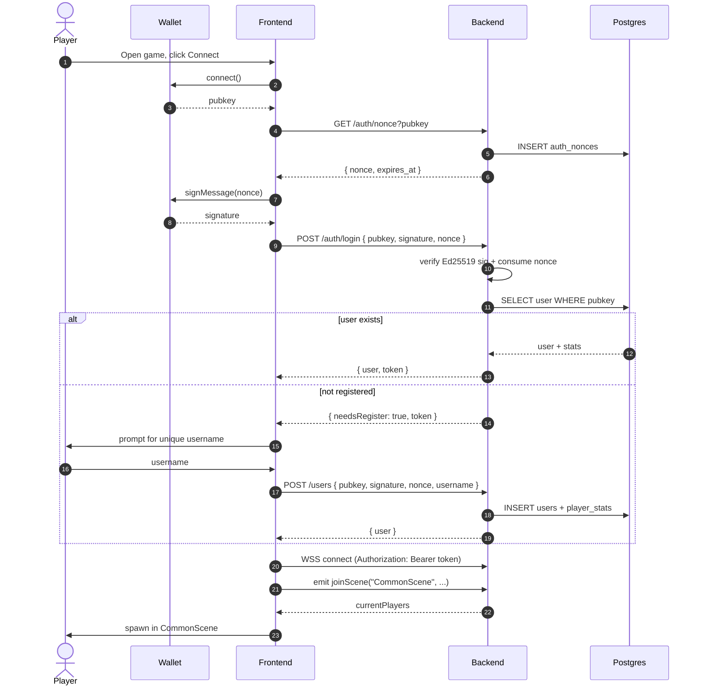
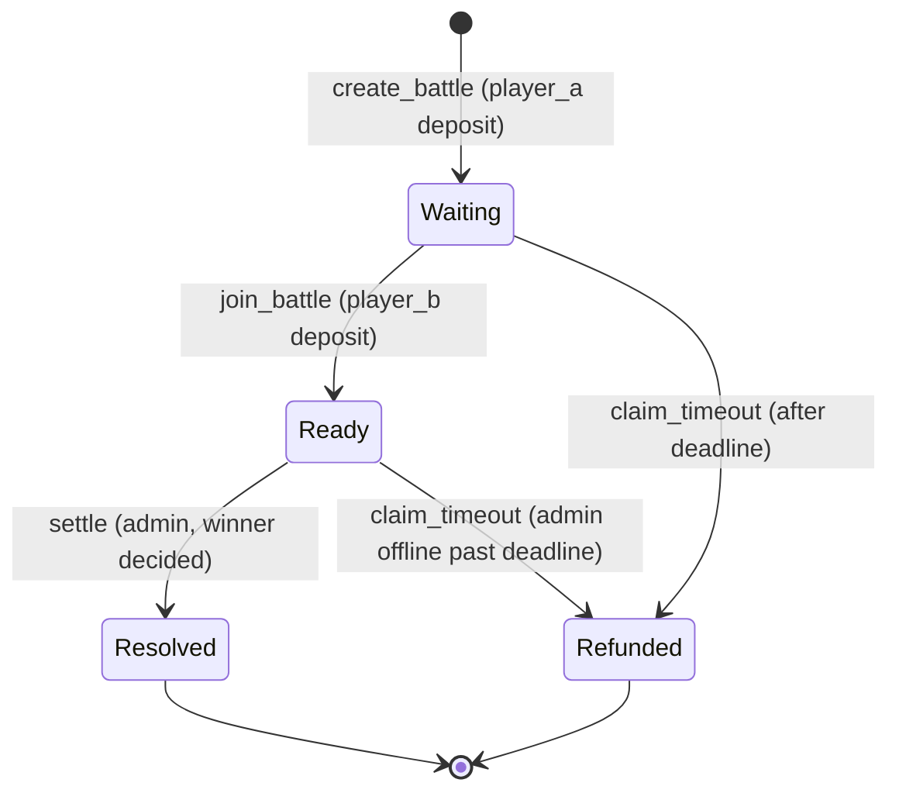

# Latch — Technical Architecture

Solana-integrated multiplayer arena. Three independent components communicate over three distinct channels; the back-end is the only signer authorised to release wager funds.

## 1. System Overview



**Trust boundary**: players sign their own deposits; the back-end signs only the `settle` payout. The back-end never holds player wager funds — only the program-derived vault does.

---

## 2. Component Stack

### Frontend
- **Vite** + **Phaser 3** (vanilla JS, ES modules, no React)
- `@solana/wallet-adapter-react` / `@solana/wallet-adapter-wallets` for wallet connection
- `@solana/web3.js` + `@coral-xyz/anchor` to build `create_battle` / `join_battle` transactions
- `socket.io-client` for the real-time channel
- Hosted on Netlify (static files only)

### Backend
- **Node.js** + **Express** + **Socket.io v4**
- **Postgres** via Prisma (recommended) for users / stats / battles
- `tweetnacl` (or `@noble/ed25519`) to verify Ed25519 wallet signatures
- `@solana/web3.js` + Anchor client to submit admin-signed `settle` transactions
- Hosted on Render free tier (kept warm via UptimeRobot)

### On-chain
- **Anchor program** on Solana devnet
- Single program; one `BattleState` account + one vault PDA per match
- Program authority (admin pubkey) set at init via a one-time `Config` account

---

## 3. Data Models

### 3.1 Postgres schema

```sql
CREATE TABLE users (
  pubkey       VARCHAR(44) PRIMARY KEY,           -- base58 Solana pubkey
  username     VARCHAR(16) UNIQUE NOT NULL,
  created_at   TIMESTAMPTZ NOT NULL DEFAULT now()
);

CREATE TABLE player_stats (
  pubkey                    VARCHAR(44) PRIMARY KEY REFERENCES users(pubkey),
  wins                      INT  NOT NULL DEFAULT 0,
  losses                    INT  NOT NULL DEFAULT 0,
  total_wagered_lamports    BIGINT NOT NULL DEFAULT 0,
  total_won_lamports        BIGINT NOT NULL DEFAULT 0,
  last_played_at            TIMESTAMPTZ
);

CREATE TABLE battles (
  battle_id        UUID PRIMARY KEY,              -- mirrors on-chain [u8;16]
  scene            VARCHAR(16) NOT NULL,          -- 'BridgeScene' | 'DungeonScene'
  player_a         VARCHAR(44) NOT NULL REFERENCES users(pubkey),
  player_b         VARCHAR(44)           REFERENCES users(pubkey),
  wager_lamports   BIGINT NOT NULL,
  status           VARCHAR(16) NOT NULL,          -- waiting|ready|in_progress|resolved|refunded
  winner           VARCHAR(44),
  vault_pda        VARCHAR(44) NOT NULL,
  create_tx        VARCHAR(88),
  join_tx          VARCHAR(88),
  settle_tx        VARCHAR(88),
  deadline_unix    BIGINT      NOT NULL,
  created_at       TIMESTAMPTZ NOT NULL DEFAULT now(),
  started_at       TIMESTAMPTZ,
  ended_at         TIMESTAMPTZ
);
CREATE INDEX battles_lobby_idx ON battles (status, scene) WHERE status = 'waiting';

CREATE TABLE auth_nonces (                        -- single-use, ~5 min TTL
  pubkey      VARCHAR(44) NOT NULL,
  nonce       VARCHAR(64) NOT NULL,
  expires_at  TIMESTAMPTZ NOT NULL,
  PRIMARY KEY (pubkey, nonce)
);
```

### 3.2 On-chain accounts (Anchor)

```rust
#[account]
pub struct Config {
    pub admin: Pubkey,        // backend's settle authority
    pub bump:  u8,
}

#[account]
pub struct BattleState {
    pub battle_id:      [u8; 16],         // matches battles.battle_id
    pub scene:          u8,               // 0 = Bridge, 1 = Dungeon
    pub player_a:       Pubkey,
    pub player_b:       Option<Pubkey>,
    pub wager_lamports: u64,
    pub status:         BattleStatus,
    pub winner:         Option<Pubkey>,
    pub deadline_unix:  i64,
    pub bump:           u8,
}

#[derive(AnchorSerialize, AnchorDeserialize, Clone, PartialEq)]
pub enum BattleStatus { Waiting, Ready, Resolved, Refunded }
```

**PDAs**
- `Config`           — seeds = `[b"config"]`
- `BattleState`      — seeds = `[b"state",  battle_id]`
- `Vault` (lamports) — seeds = `[b"vault",  battle_id]`

---

## 4. API Surface

### 4.1 REST endpoints

| Method | Path                        | Auth   | Purpose                                                   |
|--------|-----------------------------|--------|-----------------------------------------------------------|
| GET    | `/auth/nonce?pubkey=...`    | none   | Returns a single-use nonce with ~5 min TTL                |
| POST   | `/auth/login`               | sig    | `{ pubkey, signature, nonce }` → `{ user?, needsRegister?, token }` |
| POST   | `/users`                    | sig    | `{ pubkey, signature, nonce, username }` → `{ user, token }` |
| GET    | `/users/me`                 | bearer | Profile + stats for the caller                            |
| GET    | `/lobbies?scene=BridgeScene`| bearer | Currently waiting battles for a scene                     |
| POST   | `/lobbies`                  | bearer | `{ battleId, createTx }` — register a newly created lobby |
| POST   | `/battles/:id/joined`       | bearer | `{ joinTx }` — confirm second deposit landed              |

All `sig` endpoints verify `signature` against `nonce` for `pubkey` (Ed25519). Nonces are consumed on first use.

### 4.2 Socket.io events

| Direction | Event                | Payload                                                  |
|-----------|----------------------|----------------------------------------------------------|
| C → S     | `joinScene`          | `{ scene, sprite, x, y, animation, flipX }`              |
| C → S     | `movePlayer`         | `{ x, y, animation, flipX }`                             |
| C → S     | `attackPlayer`       | `targetSocketId`                                         |
| S → C     | `currentPlayers`     | `{ [socketId]: PlayerRecord }`                           |
| S → C     | `newPlayer`          | `PlayerRecord`                                           |
| S → C     | `playerMoved`        | `PlayerRecord`                                           |
| S → C     | `playerAttacked`     | `{ attacker, target, life }`                             |
| S → C     | `playerDefeated`     | `socketId`                                               |
| S → C     | `playerDisconnected` | `socketId`                                               |
| S → C     | `lobby_update`       | `{ scene, lobbies }`                                     |
| S → C     | `battle_ready`       | `{ battleId, scene, opponent }` — both deposits confirmed |
| S → C     | `battle_result`      | `{ winner, settleTx }`                                   |

The WebSocket connection upgrades the REST bearer token to an authenticated socket; on connect, the client emits `joinScene` (re-emitted on every reconnect — see `socket.js` / `net.js`).

### 4.3 Solana instructions

```text
init_config(admin: Pubkey)                          // one-time, deployer calls
  signer: deployer
  inits:  Config PDA

create_battle(battle_id: [u8;16],
              scene: u8,
              wager_lamports: u64,
              deadline_unix: i64)
  signer:  player_a (pays wager)
  inits:   BattleState PDA, Vault PDA
  effect:  transfer wager  player_a -> vault
           state = { player_a, status = Waiting }

join_battle(battle_id: [u8;16])
  signer:  player_b (pays wager)
  mutates: BattleState, Vault
  guards:  status == Waiting, now < deadline
  effect:  transfer wager  player_b -> vault
           state.player_b = Some(signer)
           state.status   = Ready

settle(battle_id: [u8;16], winner: Pubkey)
  signer:  admin (must equal Config.admin)
  mutates: BattleState, Vault, winner_account
  guards:  status == Ready,
           winner == player_a || winner == player_b
  effect:  transfer entire vault balance -> winner
           state.status = Resolved
           state.winner = Some(winner)

claim_timeout(battle_id: [u8;16])
  signer:  player_a OR player_b
  mutates: BattleState, Vault
  guards:  now >= deadline, status in { Waiting, Ready }
  effect:  return each player's wager to their wallet
           state.status = Refunded
```

---

## 5. Flow Diagrams

### 5.1 Login & registration



### 5.2 Lobby & deposit

```mermaid
sequenceDiagram
  autonumber
  actor U as Player
  participant W as Wallet
  participant FE as Frontend
  participant BE as Backend
  participant DB as Postgres
  participant P as Latch program (Solana)

  U->>FE: walk into portal house (e.g. Bridge)
  FE->>BE: GET /lobbies?scene=BridgeScene
  BE->>DB: SELECT * FROM battles WHERE status='waiting' AND scene=...
  DB-->>BE: lobbies
  BE-->>FE: lobbies
  FE->>U: render lobby UI

  alt Create new match (host)
    U->>FE: Create (wager = X SOL)
    FE->>FE: battleId = uuid(); derive Vault + State PDAs
    FE->>W: signAndSend(create_battle(battleId, wager:X, deadline))
    W->>P: tx
    P->>P: init BattleState + Vault; move X from player to vault
    P-->>W: signature
    W-->>FE: createTx
    FE->>BE: POST /lobbies { battleId, createTx }
    BE->>P: getTransaction(createTx) // confirm
    BE->>DB: INSERT battles(status='waiting', vault_pda, ...)
    BE-->>FE: ok
    BE-->>FE: lobby_update (to all clients in scene)
  else Join existing
    U->>FE: Join battle Y
    FE->>W: signAndSend(join_battle(battleId:Y))
    W->>P: tx
    P->>P: move X from player to vault; status = Ready
    P-->>W: signature
    W-->>FE: joinTx
    FE->>BE: POST /battles/Y/joined { joinTx }
    BE->>P: getTransaction(joinTx) // confirm
    BE->>DB: UPDATE battles SET status='ready', player_b, join_tx
    BE-->>FE: ok
    BE-->>FE: battle_ready { battleId, scene, opponent } (to both)
  end

  FE->>FE: scene.start("BridgeScene", { battleId })
```

### 5.3 Battle resolution & payout

```mermaid
sequenceDiagram
  autonumber
  participant A as Frontend A
  participant B as Frontend B
  participant BE as Backend
  participant DB as Postgres
  participant AW as Admin keypair
  participant P as Latch program (Solana)

  loop combat (existing engine)
    A->>BE: attackPlayer(B)
    BE->>BE: range/cone check, decrement B.life
    BE-->>A: playerAttacked
    BE-->>B: playerAttacked
  end

  Note over BE: B.life = 0  →  winner = A

  BE->>DB: UPDATE battles SET status='resolved', winner=A, ended_at=now
  BE->>DB: UPDATE player_stats (A.wins+1, B.losses+1, totals)

  BE->>AW: build settle(battleId, winner=A)
  AW->>P: signed settle tx
  P->>P: assert signer == Config.admin
  P->>P: assert state.status == Ready
  P->>P: vault balance transferred to winner
  P->>P: state.status = Resolved; state.winner stored
  P-->>AW: settleTx signature
  AW-->>BE: settleTx
  BE->>DB: UPDATE battles SET settle_tx

  BE-->>A: battle_result { winner: A, settleTx }
  BE-->>B: battle_result { winner: A, settleTx }
  A->>A: scene.start("CommonScene") (pot already in wallet)
  B->>B: play die anim → scene.start("CommonScene")
```

---

## 6. BattleState state machine



---

## 7. Security & Trust Model

- **Wallet signature auth.** Every state-changing REST call carries a one-use Ed25519 signature over a freshly-issued backend nonce. Nonces are persisted with TTL and consumed on first use to block replay.
- **Bearer token after login.** Issued JWT (or opaque) tokens bind the WebSocket to the verified pubkey; the socket uses this token for `joinScene` and combat events.
- **Funds custody.** Player wagers move directly from wallet to the Vault PDA. The backend never receives, holds, or signs over player wager flows.
- **Settle authority.** The program enforces `signer == Config.admin` on `settle`. Compromise of the admin key allows arbitrary payouts of currently-Ready vaults, **but cannot mint or steal pre-existing balances** outside of those vaults. Store the admin secret in a managed secrets store; plan key rotation via a `set_admin(new_admin)` instruction guarded by the current admin.
- **Match integrity.** HP and hit detection are server-authoritative; clients only signal intent. A compromised client cannot fake a win because the backend writes the winner before signing `settle`.
- **Timeouts.** `claim_timeout` exists so a player whose opponent disappears, or whose backend is offline past `deadline_unix`, can always recover their deposit. No funds can be stuck.
- **Reconnection.** Already implemented: the socket re-emits `joinScene` on every (re)connect so a brief network drop or Render cold-start can't leave a player invisible.

---

## 8. Open Decisions / Next Steps

1. **Wager model.** Fixed per scene, host-chosen, or floor-priced by a parameter on `Config`? Start fixed per scene; revisit before mainnet.
2. **Username constraints.** Reserved words, profanity filter, allowed character set, change cadence (probably immutable for v1).
3. **Indexer vs polling.** For confirming `createTx` / `joinTx`, start with `getTransaction` polling against the RPC; consider Helius / Triton subscriptions later.
4. **Stats integrity.** `player_stats` is derivable from `battles`; either compute on read or denormalise with a job that reconciles nightly.
5. **Mainnet migration.** Move `Config.admin` to a multisig (Squads) before mainnet; deploy under a verifiable build.
6. **Trust-minimisation path.** Long-term, replace admin `settle` with either (a) co-signed settlement (both players must sign a SettlementClaim signed by the backend) or (b) on-chain `BattleState` committed from a MagicBlock ephemeral rollup so the chain itself verifies the winner.
